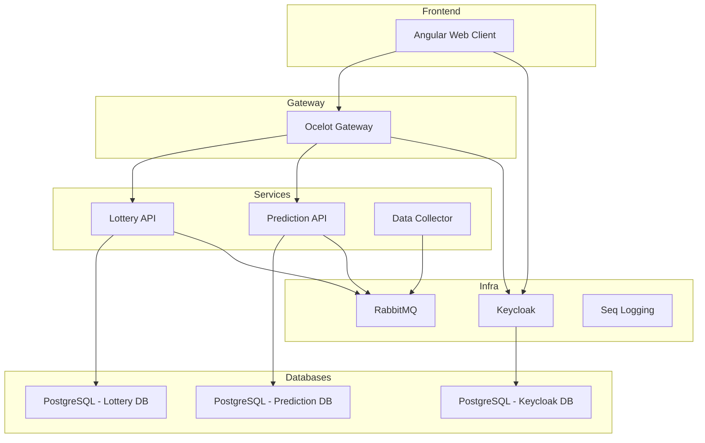

[](https://fablecode.visualstudio.com/jackpotplot)

# 🎰 Jackpot Plot

Jackpot Plot is a microservices-based application that predicts lottery outcomes using historical data collection and ML-based prediction services. It features secure authentication with Keycloak, event-driven messaging via RabbitMQ, and centralized logging through Seq — all orchestrated with Docker Compose.

---

## 🧭 Table of Contents

- [✨ Features](#-features)
- [🏗 Architecture](#-architecture)
- [🔌 Ports](#-ports)
- [🚀 Quick Start](#-quick-start)
- [⚙️ Setup Instructions](#-setup-instructions)
- [🔍 Service Overview](#-service-overview)
- [🧰 Tech Stack](#-tech-stack)
- [🔗 Helpful URLs](#-helpful-urls)
- [🤝 Contributing](#-contributing)
- [📜 License](#-license)

---

## ✨ Features

- 🎯 Lottery prediction with real-time and historical data
- 🧠 AI-powered prediction service
- 🛡 Keycloak integration for auth
- 📦 Event-driven architecture with RabbitMQ
- 🌐 Ocelot API Gateway
- 🧪 Isolated services and scalable architecture
- 🌍 Angular web client
- 📊 Centralized logs with Seq

---

## 🏗 Architecture


---

### 🛰️ **3. Ports Table**

---

## 🔌 Ports

| Service                     | Port  | Purpose                        |
|-----------------------------|-------|--------------------------------|
| Angular Web Client          | 4200  | Frontend UI                    |
| API Gateway (Ocelot)        | 8080  | Routes to backend services     |
| Lottery API                 | 5001  | Lottery operations             |
| Prediction API              | 5002  | Prediction service             |
| RabbitMQ UI                 | 15672 | Queue management               |
| RabbitMQ AMQP               | 5672  | Message transport              |
| Seq Logging UI              | 6341  | Log viewer                     |
| Keycloak Auth Server        | 8085  | User auth realm                |
| Lottery PostgreSQL DB       | 5433  | Database for lottery service   |
| Prediction PostgreSQL DB    | 5434  | Database for prediction service |
| Keycloak PostgreSQL DB      | *     | Internal container             |

---

## 🚀 Quick Start

Clone and run the app with one command:

```bash
git clone https://github.com/fablecode/jackpot-plot.git
cd jackpot-plot
docker-compose up --build
```

Then access the app via:

- **Web UI**: [http://localhost:4200](http://localhost:4200)
- **Gateway API**: [http://localhost:8080](http://localhost:8080)
- **RabbitMQ**: [http://localhost:15672](http://localhost:15672)
- **Keycloak Admin**: [http://localhost:8085](http://localhost:8085)
- **Seq Logs**: [http://localhost:6341](http://localhost:6341)


---

### 🛠️ **5. Setup Instructions**

---

## ⚙️ Setup Instructions

### 📁 Folder Structure

| Directory                                             | Purpose                             |
|--------------------------------------------------------|-------------------------------------|
| `src/Presentation/Gateway/JackpotPlot.Gateway`        | API Gateway via Ocelot              |
| `src/Presentation/Services/Lottery.API`               | Lottery microservice                |
| `src/Presentation/Services/Prediction.API`            | Prediction microservice             |
| `src/Presentation/BackgroundServices/LotteryDataCollector.Service` | Data ingestion                      |
| `src/Presentation/Clients/jackpot-plot-web`           | Angular frontend                    |
| `docker/configuration/rabbitmq`                       | RabbitMQ config + definitions       |

### 🔐 Keycloak Setup

By default, Keycloak runs on:

- **Admin user**: `admin`
- **Password**: `jackpotplot`
- **URL**: [http://localhost:8085](http://localhost:8085)

To set up:

1. Login at `/admin`.
2. Create a new realm: `jackpotplot`
3. Create clients, roles, and users as needed

### 🐇 RabbitMQ

RabbitMQ is pre-configured via volume mappings:

```yaml
volumes:
  - ./docker/configuration/rabbitmq/definitions.json:/opt/rabbitmq/definitions.json
  - ./docker/configuration/rabbitmq/rabbitmq.config:/etc/rabbitmq/rabbitmq.config
```

**Web UI available at**: [http://localhost:15672](http://localhost:15672)  
**User**: `admin`  
**Password**: `jackpotplot`

---

### 🗄 Database Connections

Each microservice connects to its dedicated Postgres instance:

# Lottery Service DB
- **Host**: `lottery-db`
- **Port**: `5432`
- **User**: `lotteryuser`
- **Password**: `lotterypassword`

# Prediction Service DB
- **Host**: `prediction-db`
- **Port**: `5432`
- **User**: `predictionuser`
- **Password**: `predictionpassword`

---

### 📋 **6. Service Overview, Tech Stack, URLs, Contributing, License**

---

## 🔍 Service Overview

| Service                   | Docker Path                                               |
|---------------------------|------------------------------------------------------------|
| Gateway                   | `src/Presentation/Gateway/JackpotPlot.Gateway`            |
| Lottery API               | `src/Presentation/Services/Lottery.API`                   |
| Prediction API            | `src/Presentation/Services/Prediction.API`                |
| Data Collector            | `src/Presentation/BackgroundServices/LotteryDataCollector.Service` |
| Angular Web App           | `src/Presentation/Clients/jackpot-plot-web`               |

---

## 🧰 Tech Stack

| Layer       | Technology      |
|-------------|-----------------|
| Frontend    | Angular         |
| Backend     | .NET Core APIs  |
| Messaging   | RabbitMQ        |
| Auth        | Keycloak        |
| Databases   | PostgreSQL      |
| Logging     | Seq             |
| Gateway     | Ocelot          |
| Container   | Docker Compose  |

---

## 🔗 Helpful URLs

| Tool        | URL                                 |
|-------------|--------------------------------------|
| Web Client  | http://localhost:4200               |
| Gateway API | http://localhost:8080               |
| RabbitMQ UI | http://localhost:15672              |
| Keycloak    | http://localhost:8085               |
| Seq Logs    | http://localhost:6341               |

---

## 🤝 Contributing

Want to help? 🎉 Fork the repo, create a branch, and submit a pull request! We're happy to collaborate.

---

## 📜 License

MIT © [Fablecode](https://github.com/fablecode)
